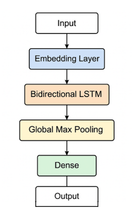
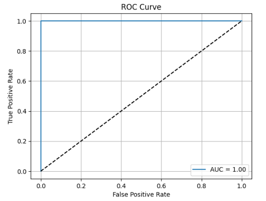
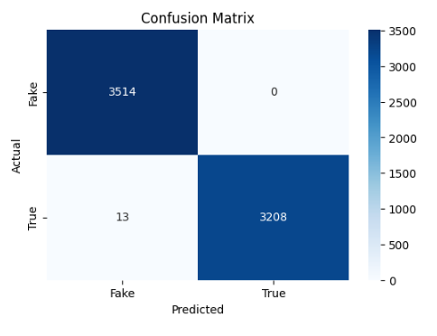

# 📰 Fake News Detection using BiLSTM

This project applies a Bidirectional LSTM (BiLSTM) neural network to detect fake news based on the content of news articles. It includes steps for data visualization, preprocessing, model building, training, and evaluation.

## 📁 Project Structure

```
.
├── data_analysis.ipynb       # Notebook for visualizing the dataset
├── lstm.ipynb                # Main notebook with BiLSTM model
├── requirements.txt          # Required Python libraries
├── News-_dataset             # Folder containing True.csv and Fake.csv after download
├── images/                   # Folder containing output plots 

````


## 🔧 Setup Instructions

1. **Clone the repository**
    ```bash
    git clone https://github.com/yourusername/fake-news-lstm.git
    cd fake-news-lstm
    ```

2. **Install dependencies**

   ```bash
   pip install -r requirements.txt
   ```

3. **Download and place the dataset**

   * Go to: [ISOT Fake News Dataset](https://onlineacademiccommunity.uvic.ca/isot/2022/11/27/fake-news-detection-datasets/)
   * Download and unzip the file.
   * Make sure that the unzipped folder, News-_dataset, contains True.csv and Fake.csv. Make sure the folder is kept in the **root directory**. 

## 📊 Data Analysis

Open `data_analysis.ipynb` and run all cells to visualize the dataset. This notebook provides:

* 📈 Number of true vs. fake news articles
* ❗ Null value check for both True and Fake news files
* ☁️ Word clouds showing most common words in each category
* 📏 Histograms showing the distribution of article lengths

| Word Cloud (True News)         | Word Cloud (Fake News)         |
| ------------------------------ | ------------------------------ |
|     |  |

## 🧠 LSTM Model

Open `lstm.ipynb` to run the full model pipeline.

### 🛠 Preprocessing steps:

* Convert text to lowercase and remove punctuation
* Filter non-alphabetic characters
* Stopword removal using NLTK
* Tokenize the cleaned text and apply padding for uniform input shape

### 📐 Model Architecture:

* Embedding Layer
* Bidirectional LSTM
* Global Max Pooling
* Dense Layers
* Sigmoid Output Layer for binary classification

| Model Architecture                |
| --------------------------------- |
|               |


## 📈 Evaluation Metrics

The model’s performance was evaluated using the following metrics:

* ✅ **Accuracy**: `99.81%`
* 🎯 **Precision**: `100.00%`
* 📡 **Recall**: `99.60%`
* 📊 **F1 Score**: `99.80%`
* 📉 **AUC (Area Under ROC Curve)**: `1.0000`
* ⚖️ **EER (Equal Error Rate)**: `0.0014` at threshold `0.0000`

| ROC Curve                          |
| ---------------------------------- |
|  |

| Confusion Matrix                                 |
| ------------------------------------------------ |
|  |

## 🧾 Conclusion

We implemented a **Bidirectional LSTM** model for fake news detection, inspired by the approach proposed in the paper [“Detecting opinion spams and fake news using text classification”](https://www.sciencedirect.com/science/article/pii/S2405959521001375).

Our results demonstrate excellent performance on the ISOT dataset, with an **AUC of 1.0** and an **accuracy of 99.81%**, showing that the model is highly capable of distinguishing between real and fake news articles. The results validate the effectiveness of Bidirectional LSTM architectures in text classification tasks.

## 📚 References

- Kadek Sastrawan, I.P.A. Bayupati, Dewa Made Sri Arsa,
Detection of fake news using deep learning CNN–RNN based methods,
ICT Express,
Volume 8, Issue 3,
2022,
Pages 396-408,
ISSN 2405-9595,
https://doi.org/10.1016/j.icte.2021.10.003.
